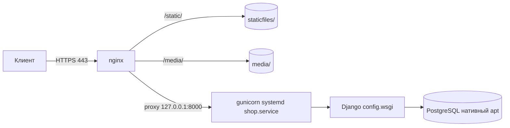
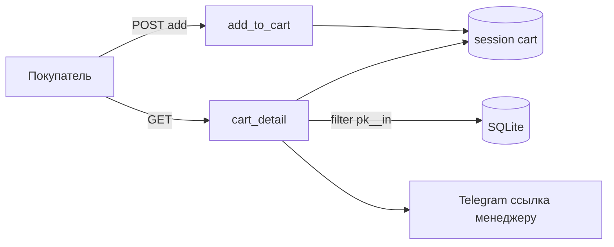
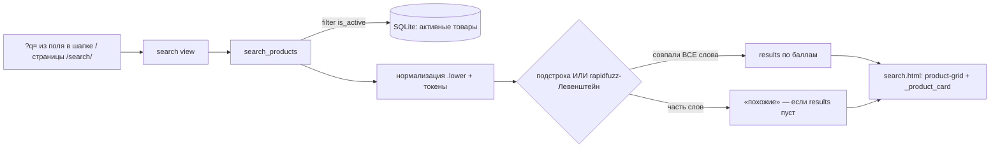
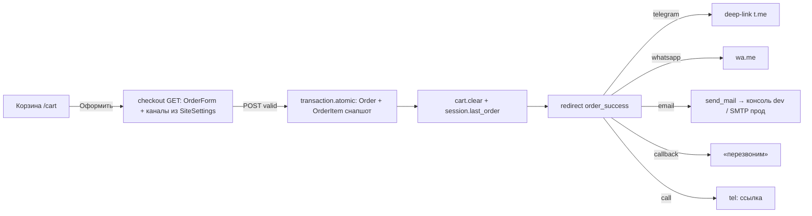

# Architecture — my_shop («СтройМаг»)
_Updated: 2026-06-08 session 034_

## Что это
Небольшой Django-магазин стройтоваров/текстиля. Каталог + корзина в сессии + оформление
заказа через выбранный канал (Telegram/WhatsApp/Email/звонок). Заказы и настройки сайта
хранятся в БД и редактируются в админке. Один app: `store`.

## Стек
- Python + Django 6.0.2
- БД: **PostgreSQL 17** — и dev (Docker, `docker-compose.yml`, порт 5433), и прод. Паритет сред (ADR 005).
  Конфиг через `DATABASE_URL` (settings._database_config, stdlib urllib.parse). Драйвер psycopg 3. SQLite убран.
- Pillow (ImageField), django-cleanup (удаление старых файлов при замене), rapidfuzz (поиск, s026)
- Прод: **gunicorn** (WSGI) + **WhiteNoise** (статика, STORAGES manifest). collectstatic → staticfiles/
- Front: серверный рендер Django-templates + Bootstrap 5 / FontAwesome с CDN (cdnjs)
- Конфиг через переменные окружения (os.environ), без django-environ; `.env.example` — шаблон

## Структура
```
config/        — проект (settings, urls, wsgi/asgi)
store/         — единственное приложение
  models.py    — SiteSettings(singleton), Category, Product, ProductSize, ProductImage(галерея), Banner, Order, OrderItem
  views.py     — функции-вью (FBV), тонкие; логика корзины вынесена
  cart.py      — Cart: корзина в сессии (структурное хранение)  ← s001
  search.py    — поиск по товарам: Python-side, rapidfuzz-Левенштейн, ранжирование  ← s026
  listing.py   — витрина: browse() фильтры/сортировка/пагинация (+релевантность для поиска)  ← s031,s032
  urls.py      — маршруты магазина
  admin.py     — товары/категории + Order(inline+статистика) + SiteSettings(singleton)  ← s002
  static/store/theme.css — дизайн-система (CSS-переменные + компоненты)  ← s005
  templates/store/ — base + _product_card + index/category/product/cart/checkout/order_success/contacts
  templates/admin/store/order/change_list.html — виджеты статистики заказов  ← s002
media/         — загруженные изображения (MEDIA_ROOT)
docker-compose.yml — dev PostgreSQL 17 (порт 5433, volume shop_pgdata)  ← s035
.env.example   — шаблон переменных окружения (прод)  ← s035
deploy/        — прод-развёртывание: gunicorn.service, nginx.conf, backup.sh, DEPLOY.md  ← s037
```

## Топология прода (ADR 006, s037 — артефакты готовы, не развёрнуто)
Один Ubuntu-VPS (РФ, 152-ФЗ), всё в `/opt/shop` (системный юзер `shop`):

- TLS: Let's Encrypt (certbot --nginx). gunicorn под systemd (3 воркера, EnvironmentFile=/opt/shop/.env).
- БД на проде — **нативный Postgres (apt)**, НЕ Docker (Docker только для dev). Паритет движка сохранён (ADR 005).
- Бэкап: `deploy/backup.sh` (pg_dump + media, cron). Обновление кода: git pull + migrate/collectstatic + restart.

## Поток данных корзины
session['cart'] = { "<product_id>:<size>": {product_id, size, qty} }
- add/remove/clear — через класс `Cart` (store/cart.py)
- Чтение позиций — ОДНИМ запросом `Product.objects.filter(pk__in=..., is_active=True)`,
  отсутствующие/скрытые товары молча выпадают и подчищаются из сессии.
- Заказ → текст с обеими ценами (розница+опт) → urlencode → ссылка t.me/{TELEGRAM_MANAGER}



## Поток поиска (s026)
Поиск идёт НЕ в БД, а в Python (`store/search.py`) — SQLite не умеет регистр кириллицы (ADR 003).

- Балл: подстрока ×2 > фуззи ×1; вес поля название>категория>описание. Порог: ≤1 (4–6 букв), ≤2 (7+).

## История изменений
| Дата | Сессия | Что |
|------|--------|-----|
| 2026-05-31 | 001 | Рефактор корзины в `store/cart.py`; POST+CSRF для mutating-вью; env-конфиг и прод-безопасность; F() для просмотров; select_related/prefetch |
| 2026-05-31 | 002 | Фаза 1 переделки: модели Order/OrderItem (снапшот цен) + SiteSettings (singleton), миграция 0003, админка со статистикой заказов (ADR 001) |
| 2026-05-31 | 003 | Фаза 2: процесс оформления (forms/notifications/context_processors/checkout/order_success), корзина-степпер, email-конфиг, 8 тестов |
| 2026-05-31 | 004 | Правки каналов: email→mailto (клиент)+серверный резерв, переименование callback/call, телефон без +7 (миграция 0004), 10 тестов |
| 2026-05-31 | 005 | Фаза 3: mobile-first редизайн — theme.css (CSS-переменные, Sora+Hanken Grotesk, --accent из SiteSettings), рерайт всех шаблонов, нижняя таб-панель/offcanvas/buybar/степпер |
| 2026-05-31 | 006 | UX-фидбэк: выбор размера на карточке/в корзине (Cart.change_size), JS-степперы (app.js), фон-оттенок+секция категорий, фикс мобильной карточки, «удалить» в отд. колонку; CDN jsdelivr→cdnjs |
| 2026-05-31 | 007 | Страница /catalog/ (catalog view) + nav; живой итог в buybar (app.js); фикс моб.корзины; плашки преимуществ + CTA-полоса; SiteSettings.hero_image (миграция 0005) |
| 2026-05-31 | 008 | Баннеры карусели → `` (фон-картинка в карусели не отображалась); баннер категории (.cat-hero с category.image); фон body плотнее+паттерн; разведены размер/кол-во; осветлены overlay |
| 2026-05-31 | 009 | Истинная причина «нет фото в баннерах» — ad-blocker режет «banner». Папка banners/→promo/ (миграция 0006), promoCarousel/.promo-slide, перенос медиа |
| 2026-05-31 | 010 | Фикс отступа размер↔кол-во (gap внутри form); Яндекс.Карта в контактах из site.address |
| 2026-05-31 | 011 | Точная метка на карте по координатам (SiteSettings.map_lat/map_lon, миграция 0007) + кнопка «Проложить маршрут» |
| 2026-05-31 | 012 | Страница /about/ (about view); иконки категорий (Category.icon, choices, миграция 0008); компоненты .stats/.steps/.feature |
| 2026-05-31 | 013 | Палитра сине-стальная+тёплый акцент; Product.is_hit + SiteSettings.low_stock_threshold/about_image (миграция 0009); бейджи на товарах; FAQ на главной; похожие товары; доработка About (выравнивание, иконки цифр, шаги) |
| 2026-05-31 | 014 | Мобильное меню-гамбургер в шапке (О магазине и др. доступны на телефоне) |
| 2026-05-31 | 015 | Расширен Category.ICON_CHOICES до ~45 (посуда/сад/обувь/сантехника/электрика/…, миграция 0010); иконки категорий в десктопном dropdown |
| 2026-05-31 | 016 | AJAX-добавление в корзину (JsonResponse при X-Requested-With) + toast-уведомления (без прыжка наверх); фикс переполнения моб.корзины; стабилизация .tabbar (overscroll-behavior, GPU-слой, bg-attachment scroll на моб.) |
| 2026-05-31 | 017 | toast наверх (моб.); согласие на ПДн (OrderForm.consent) + страница /privacy/; безопасность: Banner.link валидатор (анти-XSS, миграция 0011), баннер на stretched-link вместо onclick, CSRF_TRUSTED_ORIGINS/referrer-policy для прода |
| 2026-05-31 | 018 | Фикс горизонт. вылета на узких экранах (min-width:0 у grid-элементов, .cat-card перенос текста, body overflow-x:clip) + safe-area для нижней таб-панели |
| 2026-05-31 | 019 | Скидки: Product.discount_percent + current_retail (миграция 0012), зачёркнутая цена/бейдж −N%, корзина/заказ по скидочной цене; плавающий виджет корзины .cart-fab (моб., сумма ₽); на моб.карточке статичная кнопка вместо .buybar; cart_count/cart_total в контексте |
| 2026-05-31 | 020 | Скидка на опт: Product.discount_target (retail/wholesale/both, миграция 0013) + current_wholesale; виджет .cart-fab с анимацией выезда справа (is-shown) и показом на ПК |
| 2026-05-31 | 021 | Фикс: .tabbar непрозрачный (#fff, без backdrop-filter) — карта-iframe больше не перехватывает тапы по нижней панели; решение ПДн = вариант A (храним) |
| 2026-05-31 | 022 | Правильный фикс тапов над картой: iframe .map-frame pointer-events:none (iframe не ловит touch) + ссылка-оверлей открывает полные Яндекс.Карты; .tabbar вернули полупрозрачной с blur (s021 откатан) |
| 2026-05-31 | 023 | Счётчик корзины — белое число без пилюли; карточка товара: степпер+кнопка в один ряд (как на ПК), на моб. кнопка только иконка корзины |
| 2026-05-31 | 024 | Гостевой трекинг заказа по коду (Order.code, миграция 0014, /order/track/, ADR 002); код на success/в тексте заказа/в подвале; автоподстановка имени/телефона через localStorage |
| 2026-06-02 | 026 | Поиск по товарам: store/search.py (Python-side, rapidfuzz-Левенштейн, кириллица+опечатки), /search/ + поле в шапке + «Поиск» в моб.меню; ADR 003; зависимость rapidfuzz |
| 2026-06-02 | 027 | Тесты в зелёное (fix make_product slug + float.quantize в тесте скидки) 21/21; моб.шапка: корзина→бургер/таб-панель, на её место кнопка поиска |
| 2026-06-03 | 028 | Скидка на категорию (Category.discount_percent/target, миграция 0015) + Product.effective_discount_* (товар важнее категории, не суммируются), ADR 004; current_* через effective |
| 2026-06-03 | 029 | Косметика: розничный бейдж/price-old гейтятся по retail_discounted (скидка только на опт не рисует розничный бейдж) |
| 2026-06-03 | 030 | requirements.txt — зафиксированы прямые зависимости (Django/pillow/django-cleanup/rapidfuzz) |
| 2026-06-03 | 031 | Витрина store/listing.py (фильтры «в наличии»/«со скидкой»/цена, сортировка, пагинация PAGE_SIZE=12) на каталоге/категории/поиске; страница /sale/; галерея фото (ProductImage, миграция 0016, карусель на странице товара) |
| 2026-06-03 | 032 | Убран раздел «Скидки» (/sale/); простые фильтры каталога/категории без полей цены (фикс переполнения/таб-панели); расширенные фильтры поиска (категория/цена/в наличии/скидка/хиты/сортировка+релевантность) в offcanvas-lg (ПК-бар, моб-выезжает + «Применить») |
| 2026-06-03 | 033 | Фиксы фильтров поиска: крестик offcanvas (data-bs-target для .offcanvas-lg), убран видимый многострочный {#комментарий#}, поиск без запроса = все товары + фильтры (режимы browse/results/empty) |
| 2026-06-08 | 034 | Проект под git и запушен на github.com/GNAVA4/site (main); добавлены README.md (установка/запуск/прод) и .gitignore (venv/db/media/staticfiles/логи/.env/.idea исключены). Без изменений в коде приложения |
| 2026-06-08 | 035 | Прод-Партия 1: SQLite→PostgreSQL (dev Docker:5433 + прод через DATABASE_URL, ADR 005, psycopg 3); WhiteNoise+STORAGES (статика) + gunicorn; .env.example; чистка (TELEGRAM_MANAGER, product_list.html). 43/43 тестов на Postgres, check --deploy 0 issues |
| 2026-06-08 | 036 | Перенос ДАННЫХ SQLite→Postgres (dumpdata/loaddata 61 объект, PYTHONUTF8=1 от cp1251, reset sequences) — фикс «пустого сайта» после s035. Восстановлены cat9/prod5/img2/orders11, accent #ed7014 |
| 2026-06-09 | 037 | Деплой-бандл `deploy/` (gunicorn.service, nginx.conf, backup.sh, DEPLOY.md) + ADR 006 (топология прода: nginx+gunicorn/systemd+нативный Postgres+certbot). Артефакты готовы, не развёрнуто |
| 2026-06-09 | 038 | Админка «быстрые победы»: превью фото в списках (товары/категории/баннеры/галерея), брендирование, массовые действия заказов (статусы) + CSV-экспорт, статистика над заказами по отфильтрованному queryset (выручка без отменённых) |
| 2026-06-14 | 039 | Роль «Менеджер»: группа прав (миграция 0017, ADR 007) — полное ведение магазина без удаления заказов/категорий и без доступа к пользователям/правам; защита в коде (Order/Category has_delete = superuser-only) |
| 2026-06-14 | 040 | Авто-уведомление магазина о новом заказе: send_order_email шлётся при ЛЮБОМ канале (не только email) на SiteSettings.email + ссылка на админку; сбой не роняет оформление. Получатель — в админке, отправитель/SMTP — в env |
| 2026-06-14 | 041 | Предрелизный харднинг: honeypot на форме заказа (forms+checkout.html); SECRET_KEY-гард (raise при дефолтном ключе и DEBUG=False); уровень логов из env (DJANGO_LOG_LEVEL=INFO); раздел «Безопасность» в DEPLOY.md (ufw/ssh/fail2ban/unattended-upgrades/офсайт-бэкап) |
| 2026-06-14 | 042 | 🚀 Боевой деплой на VPS 168.222.202.42 (Ubuntu 26.04, СПб) по IP/http: nginx+gunicorn(systemd shop.service)+PostgreSQL 18; перенос данных; ufw+fail2ban+бэкап-cron+swap. Код-правка settings.py: флаг DJANGO_SECURE_COOKIES для http-этапа. Детали — STATE.prod, session_042. Осталось домен+HTTPS |

## Поток оформления заказа (s003)

- Каналы показываются только если включены флагами в SiteSettings и (для tg/wa) заполнен реквизит.
- order_success доступен только владельцу (session['last_order']==pk).

## Модели заказа (s002)
- **SiteSettings** (singleton pk=1): бренд, accent_color, контакты (phone/email/telegram/whatsapp/address/hours),
  тексты главной, булевы флаги включённых каналов. Доступ: `SiteSettings.load()`.
- **Order**: customer_name, customer_phone, contact_method (telegram/whatsapp/email/callback/call),
  comment, status (new/processing/done/canceled), снапшот total_retail/total_wholesale, created_at.
- **OrderItem**: order(FK), product(FK SET_NULL), снапшот product_title/size/qty/price_retail/price_wholesale.
  Снапшот → история заказа не меняется при правке/удалении товара.
- Статистика в админке: changelist_view агрегирует выручку, кол-во, по статусам, топ-5 товаров.
